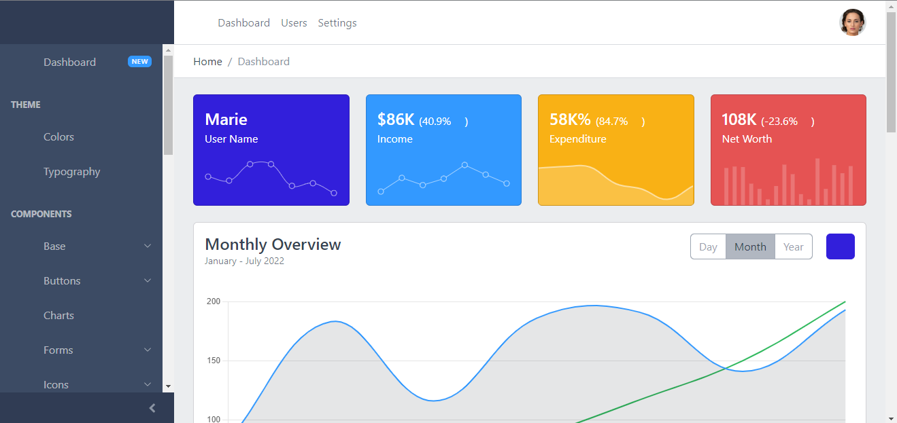
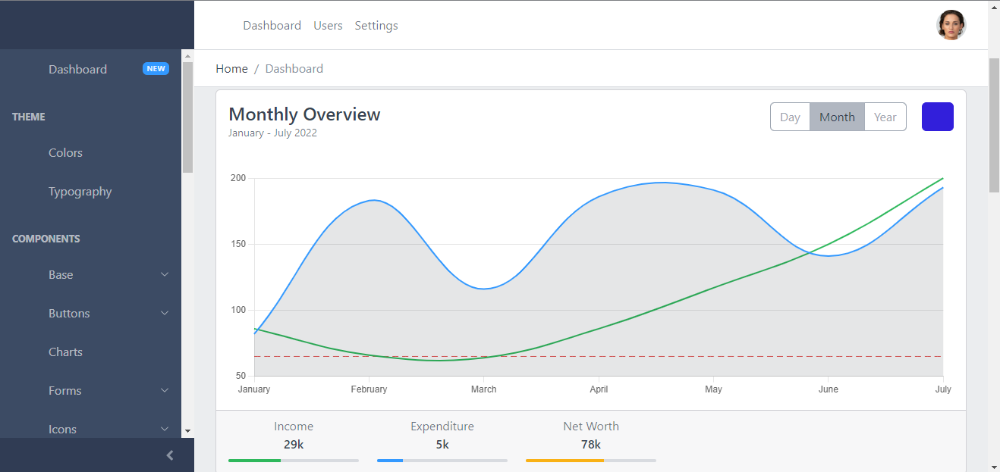

# This project is made for Inspirathon 2.0

### Our Main Dashboard

### Chart Tracker

In this project we have made website using django framework of python to not only help the rural women but everyone else who faces the problem of keeping records of their savings and expeditures.
In this website we have a static part filled with important guidelines for investment options and tricks and tips. We also have shown how to use EFT shares so that people can invest even if they have very less amount of money like < Rs.500. 

We also have built a free account service by which users can keep track of all the savings and expenditures that they have done and see the variation and percentage of the money spent or saved. We also provide varying investment options based on the total money saved and money that can be safely invested.

This website is fraud proof as it secures the user data effectively and also give safe investment options to its users.

We have used a ML model to automate the tracker as most of the people in rural areas are not well educated. This model will help them to interact with our website easily.
It will convert the voice into text. Basically we have created a Voice-to-Text engine using ML.

Using Machine Learning and Artificial Intelligence we are not only automating the process but we are revolutionising the mind-set of the people.

HOW TO OPEN THE WEBSITE:
--------------------------------------------
In order to open this website, download this repository into your local machine and extract the zip in your desired folders.
Then download all the latest version of Python libraires i.e. pip, django, virtualenv, etc.
Use pip install [package]
Eg - pip install django

Then use python manage.py runserver in the root directory where manage.py file is stored.
Eg - theChosenOnes is the base directory so we have to run the above command in this directory.
cd D:/theChosenOnes - That's how we change the directory.

I hope you will love our project.

> This project is specially made for our hardworking womens in rural areas.

Team Name - Jeetenge

Team Members
1. Deepak Katyal - Team Leader
2. Divyanshu Singh - Lead Full Stack Developer
3. Aditya Agarwal - Lead Backend End Developer
4. Samyak Jain - Lead Front End Developer
